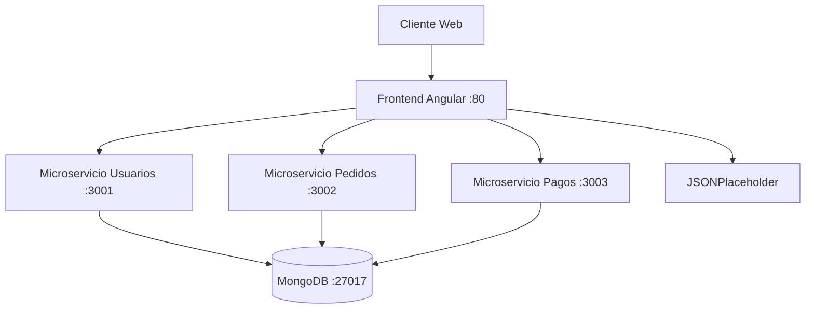

# Proyecto MVP: Plataforma de Gestión de Pedidos (Microservicios + Angular + Docker)

## 📋 Descripción General
Este proyecto es un **MVP técnico** que simula la migración de una plataforma de gestión de pedidos hacia una arquitectura de microservicios. Consta de:
- **Frontend**: Aplicación Angular (standalone components) con login simulado, menú dinámico según rol (admin/user), integración con API pública (JSONPlaceholder), modo oscuro/claro y diseño responsive.
- **Backend**: Tres microservicios independientes en .NET 8 (Usuarios, Pedidos, Pagos) que exponen endpoints `/health` y `/status`.
- **Base de datos**: Contenedor MongoDB para simular persistencia (opcional).
- **Docker**: Cada componente tiene su Dockerfile y se orquesta con `docker-compose.yml`.

## 🏗️ Diseño de Arquitectura

### Definición de Microservicios
| Microservicio | Responsabilidad |
|---------------|-----------------|
| **Usuarios**  | Gestión de usuarios (simulado). Endpoints: `/health`, `/status`. |
| **Pedidos**   | Gestión de pedidos (simulado). Endpoints: `/health`, `/status`. |
| **Pagos**     | Procesamiento de pagos (simulado). Endpoints: `/health`, `/status`. |

### Modelo de Comunicación
- **Frontend ↔ Backend**: Comunicación **REST síncrona** a través de HTTP.
- **Frontend ↔ API Pública**: Consumo de `https://jsonplaceholder.typicode.com/posts`.

### Motores de Base de Datos
- Cada microservicio tendría su propia base de datos en un entorno real. En este MVP se utiliza un contenedor **MongoDB** compartido para simular la capa de datos, aunque los microservicios no interactúan con él (solo está disponible como infraestructura de prueba).

   ### Carpeta de capturas del frontend funcionando

1. **Arquitectura completa del proyecto**  
   

2. **Login en modo claro**  
   

3. **Login en modo oscuro**  
   

4. **Menú principal (administrador)**  
   

5. **Endpoint /health del microservicio Usuarios**  
   

6. **Endpoint /health del microservicio Pedidos**  
   

7. **Endpoint /health del microservicio Pagos**  
   

8. **Vista de la API pública (JSONPlaceholder)**  
   

9. **Contenedor MongoDB en Docker**  
   

10. **Integracion datos en api publica**  
   

   ### Diagrama de Arquitectura

🤔 Justificación de Decisiones Técnicas
Frontend (Angular)
Framework: Angular 21.2.0 (standalone components) por su robustez y estructura modular.

Login simulado: Servicio AuthService con roles gestionados en localStorage.

Menú dinámico: El componente Sidebar genera opciones según el rol (admin: 5 elementos, user: 3 primeros).

Modo oscuro/claro: Variables CSS y botón toggle.

Diseño responsive: CSS puro con media queries.

API pública: Consumo de JSONPlaceholder mediante HttpClient.

Backend (.NET)
Tecnología: .NET 8 WebAPI mínima por rendimiento y facilidad para contenedores.

Endpoints: /health y /status en cada microservicio.

Proyectos independientes: Cada microservicio en su carpeta con Dockerfile propio.

Configuración de puertos: Variable de entorno ASPNETCORE_URLS=http://+:300X para escuchar en todas las interfaces.

Docker
Dockerfiles optimizados: Multistage para .NET y para Angular (build con Node + Nginx).

docker-compose.yml: Orquesta todos los contenedores con dependencias y puertos correctos.

Volumen: mongo-data para persistencia de MongoDB.

💻 Desarrollo Frontend (Angular)
Tecnologías
Angular CLI 21.2.0

Node.js 24.14.0

RxJS 7.8.2

TypeScript 5.9.3

Características Implementadas
Login simulado: Componente LoginComponent con validación. Credenciales: admin/admin (admin) y cualquier otro usuario/contraseña (user).

Roles y menú dinámico:

Admin: Dashboard, Pedidos, Pagos, API Pública, Usuarios.

User: Dashboard, Pedidos, Pagos.

API Pública: Componente ApiDataComponent que lista posts desde JSONPlaceholder.

Modo oscuro/claro: Botón toggle que cambia variables CSS.

Diseño responsive: Media queries en styles.css.

⚙️ Desarrollo Backend (.NET)
Estructura de cada Microservicio

backend/usuarios/
├── UsuariosAPI.csproj
├── Program.cs
├── appsettings.json
└── Dockerfile
(Similar para pedidos y pagos)

Endpoints Comunes
GET /health: Retorna "Healthy".

GET /status: Retorna JSON con service, uptime y timestamp.

🐳 Dockerización
Dockerfile del Frontend

FROM node:20-alpine AS build
WORKDIR /app
COPY package*.json ./
RUN npm ci
COPY . .
RUN npm run build --prod

FROM nginx:alpine
COPY --from=build /app/dist/frontend/browser /usr/share/nginx/html
COPY nginx.conf /etc/nginx/nginx.conf
EXPOSE 80

Dockerfile de un Microservicio (ej. Usuarios)
FROM mcr.microsoft.com/dotnet/sdk:8.0 AS build
WORKDIR /src
COPY ["UsuariosAPI.csproj", "."]
RUN dotnet restore "UsuariosAPI.csproj"
COPY . .
RUN dotnet build "UsuariosAPI.csproj" -c Release -o /app/build

FROM build AS publish
RUN dotnet publish "UsuariosAPI.csproj" -c Release -o /app/publish

FROM mcr.microsoft.com/dotnet/aspnet:8.0 AS final
WORKDIR /app
ENV ASPNETCORE_URLS=http://+:3001
EXPOSE 3001
COPY --from=publish /app/publish .
ENTRYPOINT ["dotnet", "UsuariosAPI.dll"]

docker-compose.yml
services:
  frontend:
    build: ./frontend
    ports:
      - "80:80"
    depends_on:
      - usuarios
      - pedidos
      - pagos

  usuarios:
    build: ./backend/usuarios
    ports:
      - "3001:3001"
    environment:
      - ASPNETCORE_ENVIRONMENT=Development

  pedidos:
    build: ./backend/pedidos
    ports:
      - "3002:3002"
    environment:
      - ASPNETCORE_ENVIRONMENT=Development

  pagos:
    build: ./backend/pagos
    ports:
      - "3003:3003"
    environment:
      - ASPNETCORE_ENVIRONMENT=Development

  mongodb:
    image: mongo:6
    ports:
      - "27017:27017"
    volumes:
      - mongo-data:/data/db

volumes:
  mongo-data:

  🚀 Pasos para Ejecutar Todo el Sistema con Docker
Prerrequisitos
Tener Docker Desktop instalado en Windows.

Ejecución
Clonar el repositorio:

git clone https://github.com/tu-usuario/proyecto-pedidos.git
cd proyecto-pedidos

Levantar los contenedores:

docker-compose up --build

Acceder a la aplicación:

Frontend: http://localhost

Microservicios:

- Usuarios: [http://localhost:3001/health](http://localhost:3001/health) y [http://localhost:3001/status](http://localhost:3001/status)
- Pedidos: [http://localhost:3002/health](http://localhost:3002/health) y [http://localhost:3002/status](http://localhost:3002/status)
- Pagos: [http://localhost:3003/health](http://localhost:3003/health) y [http://localhost:3003/status](http://localhost:3003/status)

Detener los contenedores: Ctrl + C y luego docker-compose down.

Credenciales de Prueba
Administrador: admin / admin

Usuario normal: cualquier otro usuario/contraseña (ej. user / 123)

🔗 Enlace a la API Pública Utilizada
[JSONPlaceholder - Posts](https://jsonplaceholder.typicode.com/posts)

📁 Estructura del Repositorio

proyecto-pedidos/
├── frontend/                     # Aplicación Angular
│   ├── src/
│   ├── Dockerfile
│   ├── nginx.conf
│   └── package.json
├── backend/
│   ├── usuarios/                 # Microservicio Usuarios (.NET)
│   │   ├── UsuariosAPI.csproj
│   │   ├── Program.cs
│   │   ├── appsettings.json
│   │   └── Dockerfile
│   ├── pedidos/                  # Microservicio Pedidos (.NET)
│   │   └── ...
│   └── pagos/                    # Microservicio Pagos (.NET)
│       └── ...
├── arquitectura/                 # Diagramas (opcional)
│   └── diagrama.png
├── capturas/                      # Imágenes para el README
│   ├── login.png
│   ├── menu-admin.png
│   └── api-data.png
├── docker-compose.yml
└── README.md

